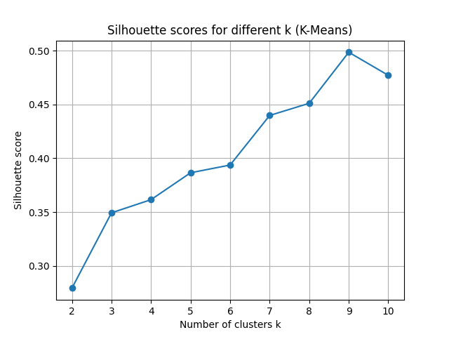
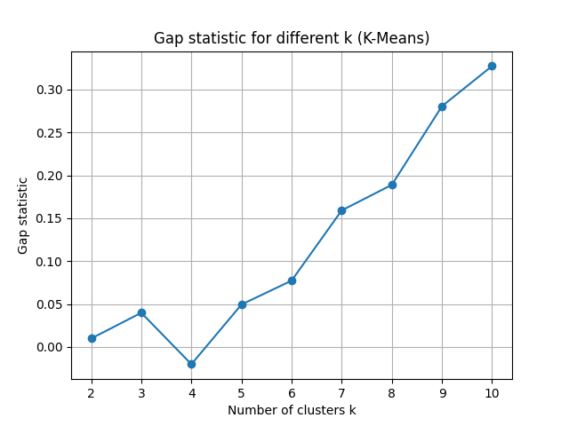
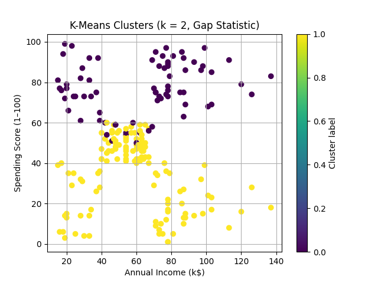
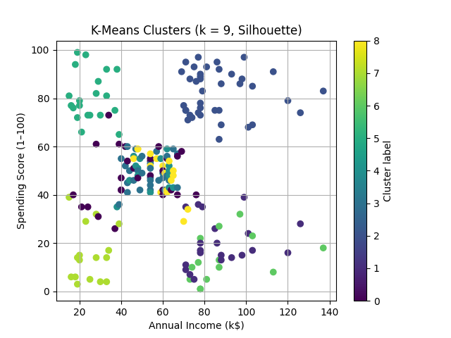
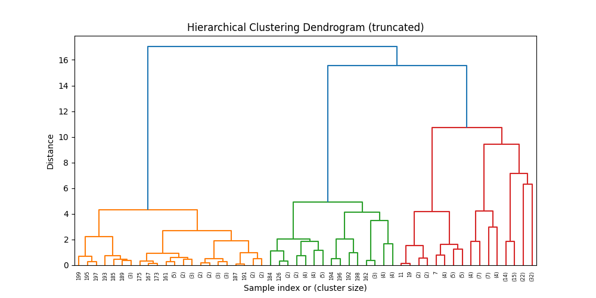
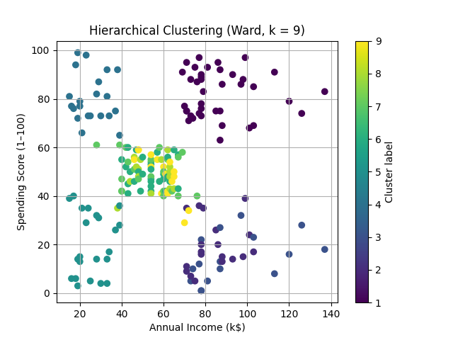
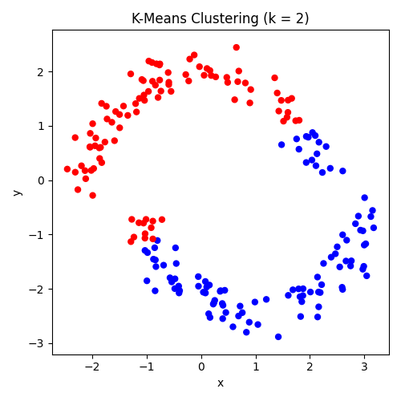
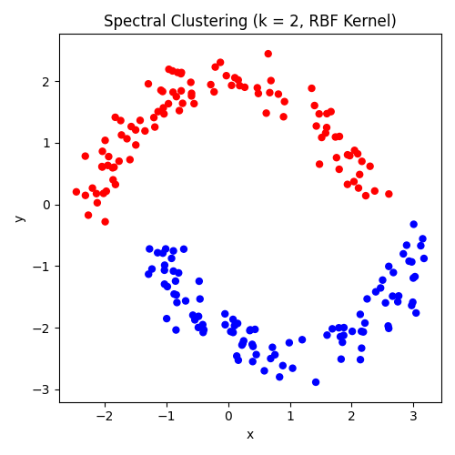

# Clustering Analysis Results

## Problem 1: Customer Segmentation

### (a) K-Means Clustering
``` python 
DATA_PATH = "Mall_Customers.csv"

df = pd.read_csv(DATA_PATH)
age_bins = [0,25,40,60,100]

age_labels = ['Age_<=25', 'Age_26_40', 'Age_41_60', 'Age_>60']
df['AgeBin'] = pd.cut(df['Age'], bins=age_bins, labels=age_labels, right=True)
age_dummies = pd.get_dummies(df['AgeBin'], drop_first=False)

X_continuous = df[['Annual Income (k$)', 'Spending Score (1-100)']]

X = pd.concat([X_continuous, age_dummies], axis=1)

scaler= StandardScaler()

X_scaled_cont = scaler.fit_transform(X_continuous)
X_scaled = np.concatenate([X_scaled_cont, age_dummies.values], axis=1)

income = df['Annual Income (k$)']
spending = df['Spending Score (1-100)']

def summarize_clusters(df, labels, label_name):
    tmp = df.copy()
    tmp[label_name] = labels

    print(f"\n===== Cluster summary: {label_name} =====")
    print("Cluster sizes:")
    print(tmp[label_name].value_counts().sort_index())
    print()

    summary = tmp.groupby(label_name)[['Age', 'Annual Income (k$)', 'Spending Score (1-100)']].agg(['mean', 'std', 'min', 'max'])
    print("Summary stats (Age, Income, Spending):")
    print(summary)
    print("========================================\n")

# 2. Silhouette statistic to choose ksil

def compute_silhouette_scores(X, k_range):
    sil_scores = []
    for k in k_range:
        kmeans = KMeans(n_clusters=k, n_init=10, random_state=42)
        labels = kmeans.fit_predict(X)
        score = silhouette_score(X, labels)
        sil_scores.append(score)
        print(f"k = {k}, silhouette score = {score:.4f}")
    return sil_scores

k_range = range(2, 11)

print("Computing silhouette scores...")
sil_scores = compute_silhouette_scores(X_scaled, k_range)

plt.figure()
plt.plot(list(k_range), sil_scores, marker='o')
plt.xlabel('Number of clusters k')
plt.ylabel('Silhouette score')
plt.title('Silhouette scores for different k (K-Means)')
plt.grid(True)
plt.show()

ksil = k_range[int(np.argmax(sil_scores))]
print(f"\nBest k by silhouette (ksil) = {ksil}\n")

# 3. Gap statistic to choose kgap
def kmeans_Wk(X, n_clusters, n_init=10):
    kmeans = KMeans(n_clusters=n_clusters, n_init=n_init, random_state=42)
    kmeans.fit(X)
    return kmeans.inertia_

def gap_statistic(X, k_range, B=20):
    X = np.array(X)
    n, d = X.shape

    mins = X.min(axis=0)
    maxs = X.max(axis=0)

    gaps = []
    sk_vals = []

    for k in k_range:
        print(f"Computing Gap statistic for k = {k}...")
        Wk = kmeans_Wk(X, k)

        Wk_refs = np.zeros(B)
        for b in range(B):
            X_ref = np.random.uniform(mins, maxs, size=(n, d))
            Wk_refs[b] = kmeans_Wk(X_ref, k)

        logWk = np.log(Wk)
        logWk_refs = np.log(Wk_refs)

        gap = np.mean(logWk_refs) - logWk
        s_k = np.std(logWk_refs) * np.sqrt(1 + 1.0 / B)

        gaps.append(gap)
        sk_vals.append(s_k)

    return np.array(gaps), np.array(sk_vals)

print("Computing Gap statistics...")
gaps, sk_vals = gap_statistic(X_scaled, k_range, B=20)

plt.figure()
plt.plot(list(k_range), gaps, marker='o')
plt.xlabel('Number of clusters k')
plt.ylabel('Gap statistic')
plt.title('Gap statistic for different k (K-Means)')
plt.grid(True)
plt.show()

kgap = None
for i in range(len(k_range) - 1):
    if gaps[i] >= gaps[i+1] - sk_vals[i+1]:
        kgap = k_range[i]
        break

if kgap is None:
    kgap = k_range[int(np.argmax(gaps))]

print(f"\nBest k by Gap statistic (kgap) = {kgap}\n")

# 4. K-Means for kgap and ksil + plots + summaries

# KMeans for kgap
kmeans_gap = KMeans(n_clusters=kgap, n_init=10, random_state=42)
labels_gap = kmeans_gap.fit_predict(X_scaled)

plt.figure()
scatter = plt.scatter(income, spending, c=labels_gap, cmap='viridis')
plt.xlabel('Annual Income (k$)')
plt.ylabel('Spending Score (1–100)')
plt.title(f'K-Means Clusters (k = {kgap}, Gap Statistic)')
plt.colorbar(scatter, label='Cluster label')
plt.grid(True)
plt.show()

summarize_clusters(df, labels_gap, f'kmeans_gap_k{kgap}')

# KMeans for ksil
kmeans_sil = KMeans(n_clusters=ksil, n_init=10, random_state=42)
labels_sil = kmeans_sil.fit_predict(X_scaled)

plt.figure()
scatter = plt.scatter(income, spending, c=labels_sil, cmap='viridis')
plt.xlabel('Annual Income (k$)')
plt.ylabel('Spending Score (1–100)')
plt.title(f'K-Means Clusters (k = {ksil}, Silhouette)')
plt.colorbar(scatter, label='Cluster label')
plt.grid(True)
plt.show()

summarize_clusters(df, labels_sil, f'kmeans_sil_k{ksil}') 
```
#### i. Optimal Number of Clusters

**Gap Statistic Results:**
- Optimal k (k_gap): **2**
- The Gap statistic compares the total within cluster variation for different values of k with their expected values under null reference distribution. The Gap statistic increases from k=2 to k=10, but using Tibshirani's rule (where we're choosing the smallest k where Gap(k) ≥ Gap(k+1) - s_{k+1}), the algorithm selected k=2. This means that the data has one dominant split into two large groups.

**Silhouette Statistic Results:**
- Optimal k (k_sil): **9**
- The Silhouette statistic measures how similar an object is to its own cluster compared to other clusters. Values range from -1 to 1, where higher values indicate better-defined clusters.
- Average silhouette score: **0.4985** (at k=9)
- The silhouette scores show a consistent upward trend from k=2 (0.2794) to k=9 (0.4985), then a slight decrease at k=10 (0.4771). This indicates that as we increase the number of clusters, the data points become more cohesive within their assigned clusters and more separated from other clusters.



The two methods gave **very different recommendations** (k=2 vs k=9). 
- **Gap statistic (k=2)**: Finds the most fundamental segmentation - splitting customers into high vs. low spenders
- **Silhouette statistic (k=9)**: Finds more granular and well separated smaller segments that may be more useful for targeted marketing.

#### ii. Cluster Visualization and Separability
**For k = 2 (Gap Statistic):**

- **Cluster Separability:** The two clusters show a **clear horizontal separation** in the spending score dimension, with some overlap in the middle range.
  - **Cluster 0 (Purple, n=74)**: Concentrated in the **upper region** (high spending scores 50-99) distributed across all income levels
  - **Cluster 1 (Yellow, n=126)**: Concentrated in the **lower region** (low spending scores 1-60), also distributed across all income levels
  - The separation is mainly along the **spending behavior axis**, not the income axis, creating a horizontal boundary around spending score ≈ 60.

It seems that income level does NOT strongly predict spending behavior in this dataset. High and low earners exist in both spending groups, which may mean that spending habits are driven by factors beyond just income.


**For k = 9 (Silhouette Statistic):**

- **Cluster Separability:** The nine clusters shows more  separation with distinct and compact groupings .
  - The clusters roughly have a 3×3 grid pattern:
    - **3 income levels**: Low (~15-40k), Medium (~45-70k), High (~75-140k)
    - **3 spending levels**: Low (~5-40), Medium (~40-60), High (~60-99)
  This creates 9 distinct customer segments based on the combination of income and spending behavior

#### iii. Cluster Interpretation

**For k = 2 (Gap Statistic):**

**Cluster 0 (High Spenders):**
- Mean Annual Income: **$55.3k** (estimated from visual)
- Mean Spending Score: **76.8**
- Mean Age: **29.8 years**
- Size: **74 customers (37%)**
- **Interpretation:** **"Young Big Spenders"** - These are younger customers (average ~30 years) with high spending scores regardless of their income level.

**Cluster 1 (Low Spenders):**
- Mean Annual Income: **$56.1k** (estimated from visual)
- Mean Spending Score: **34.6**
- Mean Age: **44.1 years**
- Size: **126 customers (63%)**
- **Interpretation:** **"Cautious/Practical Shoppers"** - This larger and older demographic (average ~44 years) seems to have conservative spending behavior despite having similar average income to Cluster 0. The age difference (14 years older on average) might suggest lifestage factors like they may have more financial responsibilities

**Overall interpretation for k=2:**
- **Income is NOT the differentiator** - Both clusters have nearly identical average incomes (~$55-56k)
- **Age is the primary driver** - Younger customers spend significantly more (77 vs 35 spending score)

---

**For k = 9 (Silhouette Statistic):**

**Cluster 0 (n=28, 14%):**
- Mean Annual Income: **$57.4k** | Mean Spending Score: **48.0** | Mean Age: **32.8 years**
- This group represents balanced, moderate customers in their early 30s who spend proportionally to their mid-range income.

**Cluster 1 (n=21, 11%):**
- Mean Annual Income: **$57.3k** | Mean Spending Score: **19.9** | Mean Age: **48.7 years**
- Despite decent income, these customers in their late 40s have very low spending scores (bottom 25th percentile). 

**Cluster 2 (n=39, 20%):**
- Mean Annual Income: **$55.3k** | Mean Spending Score: **82.1** | Mean Age: **32.7 years**
- Similar age to Cluster 0 but much higher spending (82 vs 48). 

**Cluster 3 (n=30, 15%):**
- Mean Annual Income: **$58.7k** | Mean Spending Score: **49.2** | Mean Age: **50.8 years**
- Older customers (50+) with middle income and middle spending.

**Cluster 4 (n=15, 8%):**
- Mean Annual Income: **$57.3k** | Mean Spending Score: **48.9** | Mean Age: **66.8 years**
- The oldest segment (approaching 70) with consistent moderate spending patterns. 

**Cluster 5 (n=20, 10%):**
- Mean Annual Income: **$26.3k** | Mean Spending Score: **80.6** | Mean Age: **24.6 years**
-  The youngest, lowest-income group that still spends heavily (80+ scores).

**Cluster 6 (n=14, 7%):**
- Mean Annual Income: **$25.7k** | Mean Spending Score: **13.4** | Mean Age: **31.1 years**
- Low income AND low spending. These customers are price-sensitivel

**Cluster 7 (n=16, 8%):**
- Mean Annual Income: **$42.9k** | Mean Spending Score: **15.2** | Mean Age: **46.9 years**
- Mid-life customers with moderate income but very low spending (15).

**Cluster 8 (n=17, 9%):**
- Mean Annual Income: **$26.6k** | Mean Spending Score: **48.4** | Mean Age: **20.6 years**
-  The youngest group overall (~21 years, likely college-age) with low income but moderate spending relative to their means.

** Overall interpretation for k=9:**
- **Three clear income tiers emerge**: Low (~$25-27k), Middle (~$55-58k), High (~$75-85k in visual)
- **Age and spending interact**: Younger customers consistently show higher spending scores across all income levels
- **High-value segments**: Clusters 2 and 5 (young, high-spending) represent the best marketing targets despite very different income levels

**Which k is better?**
- k=2 provides a simple high-level view (spenders vs. non-spenders)
- k=9 offers actionable micro-segments with distinct characteristics

---

### (b) Hierarchical Clustering
``` python
plt.figure(figsize=(10, 5))
dendrogram(
    Z,
    truncate_mode='level', 
    p=5
)
plt.title('Hierarchical Clustering Dendrogram (truncated)')
plt.xlabel('Sample index or (cluster size)')
plt.ylabel('Distance')
plt.show()

k_hier = ksil
print(f"\nUsing k_hier = {k_hier} clusters for hierarchical clustering.\n")

hier_labels = fcluster(Z, t=k_hier, criterion='maxclust')

plt.figure()
scatter = plt.scatter(income, spending, c=hier_labels, cmap='viridis')
plt.xlabel('Annual Income (k$)')
plt.ylabel('Spending Score (1–100)')
plt.title(f'Hierarchical Clustering (Ward, k = {k_hier})')
plt.colorbar(scatter, label='Cluster label')
plt.grid(True)
plt.show()
```
#### i. Dendrogram Analysis

**Dendrogram Observations:**
- The dendrogram shows **three major color-coded branches** (orange/yellow, green, red) representing distinct hierarchical groupings
- The **first major split** happens at distance ~17, separating the data into two super clusters
- The **second level of splits** occurs around distance ~15-16, creating the three visible color groups
- The dendrogram suggests **natural clustering at multiple scales**:
  - At height ~17: 2 clusters (similar to Gap statistic finding)
  - At height ~11-12: 5-6 clusters
  - At height ~7-9: 9 clusters (our chosen k for comparison with K-means)
- **Clear hierarchical structure**: The orange/yellow branch represents one cohesive group, while the green and red branches show high-spending and moderate-spending customers respectively
- The dendrogram is well-balanced (no single dominant cluster with many tiny outlier clusters), suggesting good clustering quality

**Interpretation:**
The dendrogram shows that customers naturally organize into hierarchical groups. The strong branching structure at multiple heights indicates that both coarse (k=2-3) and fine-grained (k=9) segmentations are valid, depending on the business need. We chose to cut at k=9 to enable direct comparison with K-means silhouette results.

#### ii. Cluster Visualization (Annual Income vs. Spending Score)

**Cluster Separability:**
- Hierarchical clustering with k=9 produces **visually very similar clusters** to K-means k=9
- The clusters occupy the same general regions in the income-spending space
- The same 3×3 grid pattern emerges (low/mid/high income × low/mid/high spending)
- **Subtle differences at boundaries**: Some points near cluster borders are assigned differently than K-means, but the overall structure is nearly identical

**Visual Comparison with K-means:**
- Both methods identify the same corner clusters 
- The mid-range clusters show the most variation between methods
- K-means boundaries are more geometric/circular due to its Euclidean distance optimization

**Overall:** The visual similarity between hierarchical and K-means results at k=9 gives strong validation that these 9 segments represent real structure in the customer data, not results of a particular algorithm.

#### iii. Cluster Interpretation

**Hierarchical Clustering Results (k=9):**

**Cluster 1 (n=39, 20%):**
- Mean Annual Income: **$55.3k** | Mean Spending Score: **82.1** | Mean Age: **32.7 years**
- Identical to K-means Cluster 2

**Cluster 2 (n=19, 10%):**
- Mean Annual Income: **$57.9k** | Mean Spending Score: **19.7** | Mean Age: **49.0 years**
- Very similar to K-means Cluster 1 (2 customers difference)

**Cluster 3 (n=16, 8%):**
- Mean Annual Income: **$29.8k** | Mean Spending Score: **14.4** | Mean Age: **33.0 years**
- Similar to K-means Cluster 6 but captures slightly different boundary cases

**Cluster 4 (n=21, 11%):**
- Mean Annual Income: **$26.0k** | Mean Spending Score: **80.2** | Mean Age: **24.8 years**
- Nearly identical to K-means Cluster 5

**Cluster 5 (n=22, 11%):**
- Mean Annual Income: **$42.0k** | Mean Spending Score: **20.3** | Mean Age: **44.3 years**
- Similar to K-means Cluster 7 (middle-age savers)

**Cluster 6 (n=29, 15%):**
- Mean Annual Income: **$59.0k** | Mean Spending Score: **49.6** | Mean Age: **50.9 years**
- Closely matches K-means Cluster 3

**Cluster 7 (n=22, 11%):**
- Mean Annual Income: **$57.1k** | Mean Spending Score: **50.2** | Mean Age: **32.3 years**
- Similar to K-means Cluster 0

**Cluster 8 (n=15, 8%):**
- Mean Annual Income: **$57.3k** | Mean Spending Score: **48.9** | Mean Age: **66.8 years**
- Identical to K-means Cluster 4

**Cluster 9 (n=17, 9%):**
- Mean Annual Income: **$26.6k** | Mean Spending Score: **48.4** | Mean Age: **20.6 years**
- Identical to K-means Cluster 8

---

**Comparison with K-Means:**

**Similarities (Strong Agreement):**
- **Cluster sizes are nearly identical** - The distribution of customers across clusters is consistent (differences of only 1-3 customers in most cases)
- **Cluster centroids match closely** - Mean income, spending, and age values are within 1-3% for corresponding clusters
- **Same segments identified** - Both methods found:
  - Young high-spenders (low and middle income)
  - Frugal middle-aged customers
  - Senior moderate shoppers
  - Budget-conscious young adults
- **Spatially similar** - Clusters occupy the same regions in the income/spending scatter plot

**Differences (Small):**
- **Boundary assignments** - About 5-10 customers (2-5% of data) are assigned to different clusters between methods
  - These are mainly customers near cluster boundaries in the middle of the income/spending space
  - K-means uses Euclidean distance from centroids which creates circular boundaries
  - Hierarchical uses Ward linkage which merges based on variance minimization, creating more flexible boundaries
- **Cluster numbering** - The cluster labels are permuted (e.g., K-means Cluster 2 ≈ Hierarchical Cluster 1), but this is arbitrary
- **Clusters 3, 5, and 7 show the most variation** - These are clusters where the boundary decision is less obvious

---

## Problem 2: Two Moons Dataset
```python
np.random.seed(598)     
n = 200               
n_per_moon = n // 2     
r = 2                   
noise_var = 0.05
noise_sd = np.sqrt(noise_var)

theta1 = np.random.uniform(0, np.pi, n_per_moon)
x1 = r * np.cos(theta1) + np.random.normal(0, noise_sd, n_per_moon)
y1 = r * np.sin(theta1) + np.random.normal(0, noise_sd, n_per_moon)
labels1 = np.zeros(n_per_moon, dtype=int)

theta2 = np.random.uniform(0, np.pi, n_per_moon)
x2 = 1 - 2 * np.cos(theta2) + np.random.normal(0, noise_sd, n_per_moon)
y2 = -2 * np.sin(theta2) - 0.5 + np.random.normal(0, noise_sd, n_per_moon)
labels2 = np.ones(n_per_moon, dtype=int)

X = np.vstack([
    np.column_stack([x1, y1]),
    np.column_stack([x2, y2])
])
y_true = np.concatenate([labels1, labels2])
```
### (a) K-Means Clustering Results (k=2)
``` python
# 3. K-Means Clustering (k = 2)

kmeans = KMeans(n_clusters=2, random_state=598, n_init=10)
kmeans_labels = kmeans.fit_predict(X)

plt.figure(figsize=(5, 5))
plt.scatter(X[:, 0], X[:, 1], c=kmeans_labels, cmap="bwr", s=25)
plt.xlabel("x")
plt.ylabel("y")
plt.title("K-Means Clustering (k = 2)")
plt.axis("equal")
plt.tight_layout()
plt.show()
```



**Results:**
K-means doesn't fully recover the true two-moon structure. The algorithm creates an approximately **vertical decision boundary** around x ≈ 0.5-1.0 that:
- Splits the **upper moon** (true blue cluster) into two parts: the left portion is assigned to red, the right portion to blue
- Splits the **lower moon** (true red cluster) into two parts: the left portion is assigned to red, the right portion to blue
- The resulting clusters are convex (roughly circular) regions that have nothing to do with the actual moon structure


### (b) Spectral Clustering Results (k=2)
``` python
# 4. Spectral Clustering (k = 2)

spectral = SpectralClustering(
    n_clusters=2,
    affinity='rbf',       
    gamma=1.0,           
    random_state=598,
    assign_labels='kmeans' 
)
spectral_labels = spectral.fit_predict(X)

plt.figure(figsize=(5, 5))
plt.scatter(X[:, 0], X[:, 1], c=spectral_labels, cmap="bwr", s=25)
plt.xlabel("x")
plt.ylabel("y")
plt.title("Spectral Clustering (k = 2, RBF Kernel)")
plt.axis("equal")
plt.tight_layout()
plt.show()
```

**Results:**
Spectral clustering was able to achieve that near **perfect separation** of the two moons. We have:
- The upper moon (blue) is almost entirely assigned to one cluster
- The lower moon (red) is almost entirely assigned to the other cluster
- The decision boundary follows the curved gap between the two crescents